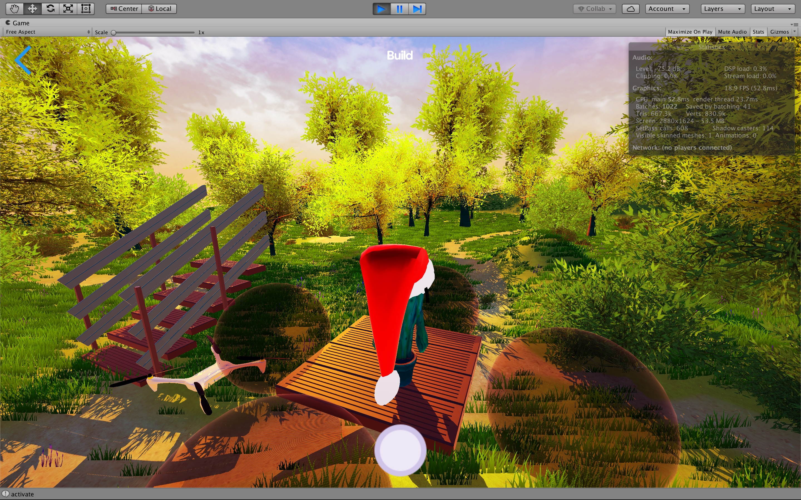

# unity_cactus_game_archived

(late 2016 / early 2017)
A game I wanted to make in Unity.

One could build like in minecraft (more like well, now, in fortnite) but instead of taking on a first person perspective, the goal was to make building easier by giving them predefined places on other objects to build. 
It was great but the scope was too big. My little cousins loved it.

My main takeaway is: it turns out you shouldn't do something just because you can. Focus is key.

#In game

#Building
